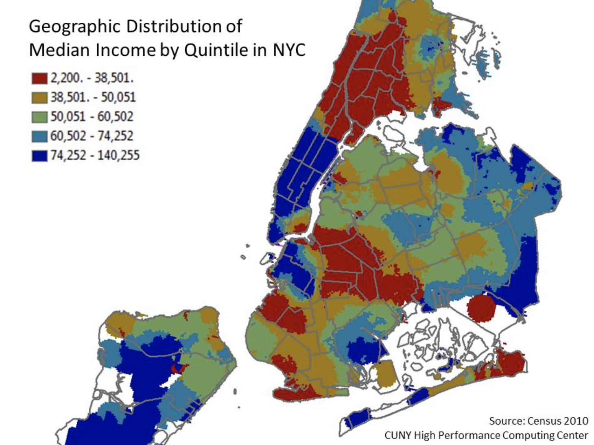

## Problem Statement

While the state of having a great deal of money wealth or affluence should never be a factor when choosing to provide disaster aid or not, we must consider the following:

On the assumption that affluence, 15% 200,000 dollar or more earners per zip code, plays a role; one might relate affluency to preparedness. Those who can afford to, will always look out for their families at any cost. Those who cannot might not be able to prepare as well due to the fact that they might not have the resource to do so.

On the assumption that affluence is not part of a majority class, if we should be myopic with our search efforts, we might want to consider saving the masses, those living in tight corridors and those with little to no income. If effect those most susceptible to losing their lives in a major disaster.

Using tax data, we aim to show that using YELP data dollar signs is enough to predict where we might want to quickly and accurately align our efforts.

Below is a map of disaster count for New York where our model will focus.

Focusing on New York we see that there are a total of 12 natural disasters from 1930 to 2010.

The following is a map of Super - Severe natural disasters in the entire nation from 1930 to 2010.

Focusing on New York we see that there are a total of 3 Super - Severe natural disasters from 1930 to 2010 which, as a ratio of natural disasters that have occured, is a rather large number. Thus focusing efforts on New York could have a large impact on a large population. 

Below is a colormap broken down by income. Although the bins are not exact in both cases, they are close and thus comparing this map to the cluster map below, formed from our unsupervised cluster fit, we get similar areas of affluency.

Citation : https://www.scientificamerican.com/article/natural-disasters-by-location-rich-leave-and-poor-get-poorer/ 

Citation : http://communitystudies.qwriting.qc.cuny.edu/2011/11/09/income-distribution/

New Light Technologies as our audience, we hope to show that while using expensive and hard to handle data such as tax data can be more precise, a quick and dirty aproach could be to simply sord though the dollar signs data on yelp. 

## Executive Summary

At the start of this project, our team had some naive assumptions about how strongly the Yelp “\\$$$$” price of a business correlated to the affluency of the area it was in. Namely, we assumed the higher the Yelp price, the higher the affluence. And this is where we first encountered the issue of how we were going to define "affluence".

In our definition of "affluence", we needed to be objective and systematic. After some research, we settled on IRS tax return data. These data showed the tax returns by zip code along with the income brackets for those returns. By looking through each zip code and calculating the proportion of individuals in the highest bracket, we had our "affluency rate". We simply needed to settle on an arbitrary threshold, which we determined through research and subjective selection.

We also debated on which Yelp dataset to use, of which there were two - a large given dataset and the Yelp API. The given dataset was massive but included areas from all over the US with the vast majority being from Arizona. The Yelp API offered us the flexibility to select the locations we wanted to pull data for. Also, these data would be immediately up to date. For these reasons, we settled on using the Yelp API. Regarding location, New York City (NYC) experienced 25% of all the worst, or super severe, disasters occurring in the US from 1930 to 2010, which makes is a priority target for this problem. We also agreed to focus on NYC since each team member was already familiar with NYC and could bring subject knowledge to bear during the process. 
We believed we could use NYC to successfully show a proof of concept for our model.

While modeling, we ran into some issues. First, we had longitude and latitude data for businesses, and we wanted to use them inform our model, but by themselves longitude and latitude were not significant factors. We ended up clustering longitude and latitude to create a new feature, which succinctly summarized the general location of each observation. We also ended up with almost 300 features, to which we had relatively few total observations. Although not a large concern, we decided to explore models using all the variables and, separately, a restricted number of features showing the highest correlation with our target. Lastly, we initially used accuracy as our model metric, but quickly discovered this was not ideal given the problem, which involves emergency response. Our use-case involves potentially sending vital resources to those in the most need - as such we wanted to focus on reducing false negatives and settled on specificity as our main metric.

In all, we set out to discover how related the Yelp “\\$$$$” price is to affluency and we effectively achieved this goal. It was also interesting to discover how significant review ratings and location played in predicting affluency.